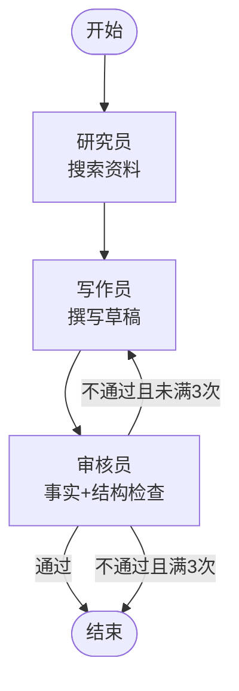

# 多智能体报告系统

基于 LangGraph 的多智能体协作系统：三个智能体分工，自动完成"搜索资料 → 撰写报告 → 审核反馈"的全流程。

## 运行前提

- Python 3.9+
- 需要 `.env` 文件，内容如下：

```
DASHSCOPE_API_KEY=你的key
DASHSCOPE_BASE_URL=https://api.dashscope.com
```


## 安装

```bash
pip install -r requirements.txt
```
## 运行

**网页版（推荐，能看到流程动画）：**

```bash
python -m streamlit run app.py
```

**命令行版：**

```bash
python main.py
```

## 系统架构

三个智能体按顺序协作，审核不通过时送回写作员重写（最多改 3 版）：



## 三个 Agent 的职责分工

| 角色 | 节点函数 | 干嘛的 | 产出字段 |
|------|---------|--------|---------|
| 研究员 | `researcher_node` | 搜索资料，提炼关键事实和一句话总结 | `research_notes` |
| 写作员 | `writer_node` | 依资料撰写报告草稿；收到审核意见则按意见重写 | `draft` |
| 审核员 | `reviewer_node` | 检查结构完整性 + 事实是否与资料一致、有无编造 | `passed` / `feedback` / `final_report` |

## 文件结构

```
MultiAgent_Report/
├── main.py          # 命令行入口
├── app.py           # Streamlit 网页版入口
├── llm.py           # 配置大模型（ChatTongyi）
├── requirements.txt # 依赖清单
├── graph/
│   └── state.py     # 工单说明书（ReportState）
│   └── workflow.py  # 组装图 + 分拣员
└── agents/
    ├── researcher.py # 研究员：搜索资料
    ├── writer.py     # 写作员：撰写/改写草稿
    ├── reviewer.py   # 审核员：事实+结构检查
    └── schemas.py    # 三种结构化输出模板
```

## 修改报告主题

在 `app.py` 的输入框里，或修改 `main.py` 里的 `state["topic"]`。


## 我学到了什么

1. **LangGraph 的条件路由 = 让工作流会"打回重做"**：用 `add_conditional_edges` 设一个分拣函数，审核不通过就送回写作员改稿（最多 3 版），实现了闭环质量控制，而不是一条直线跑到底。
2. **工单（state）是节点之间传话的唯一方式**：每个节点只改自己负责的字段，靠共享的 state 传递数据。谁改哪个字段必须分清，不然状态会乱。
3. **结构化输出约束每个 Agent**：用 Pydantic 模板（ResearchResult / DraftReport / ReviewResult）固定输出格式，不然大模型自由发挥的结果没法接着用。
4. **工作流能一键变成 API**：用 FastAPI 包成 `POST /report`，`await workflow.ainvoke()` 异步调用，任何前端都能调用整条多智能体流水线。
5. **大模型输出不稳定，要加重试兜底**：qwen 的 `with_structured_output` 偶尔返回格式错或空，用 `call_with_retry` 重试才稳。


